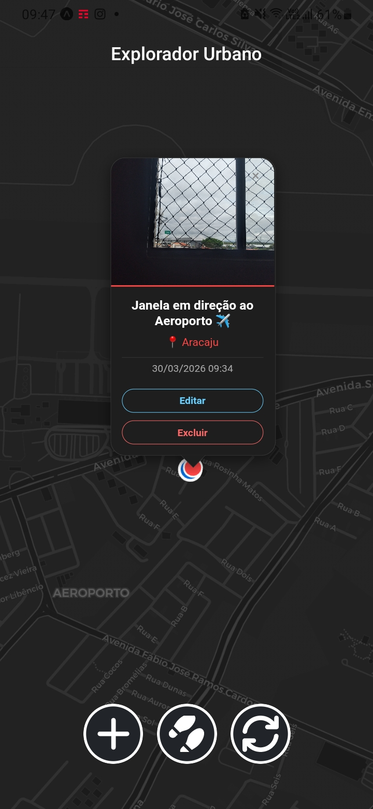
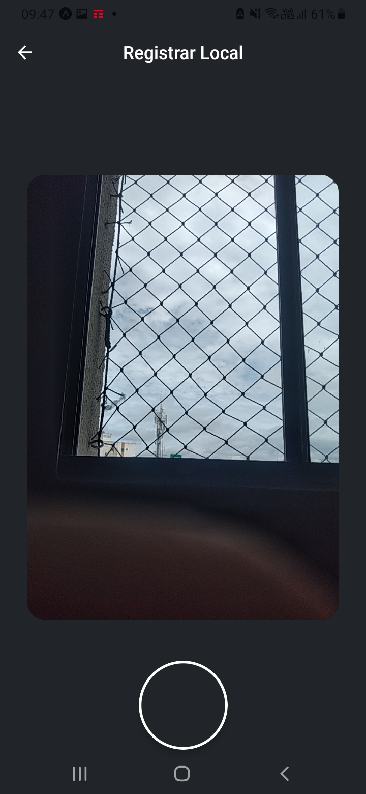
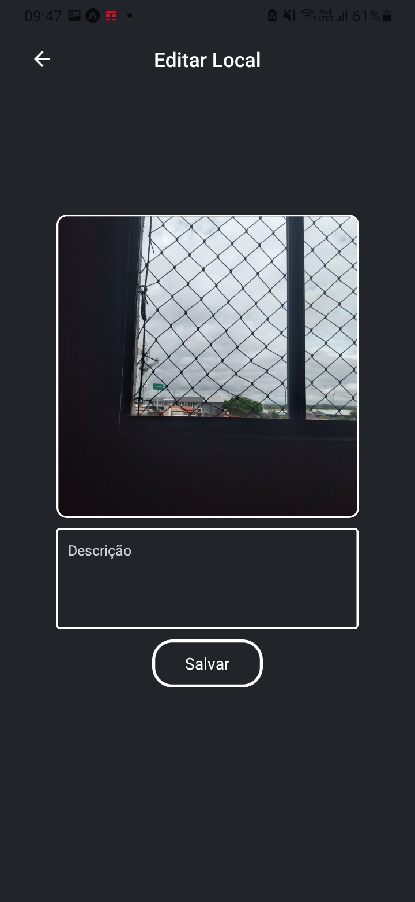
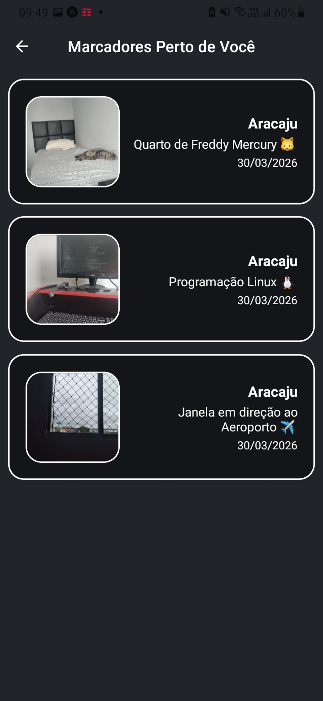
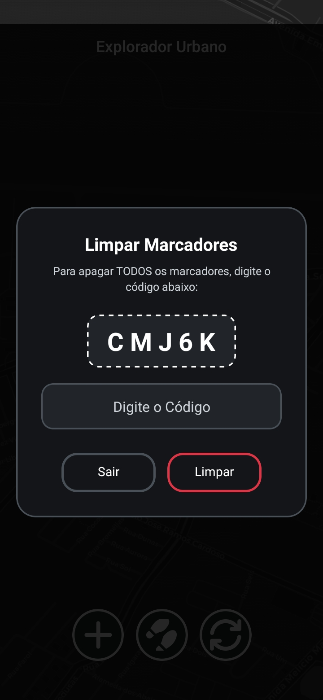

<div align="center">
  
  
  <h1>Explorador Urbano</h1>
  <p><i>Seu Diário de Bordo Digital para Aventuras na Cidade</i></p>
  
  <hr />
</div>

O **Explorador Urbano** é um diário de bordo digital para quem ama exploração. O aplicativo permite capturar locais, registrar a localização exata de cada descoberta e visualizar todos os seus marcadores em um mapa interativo.

Este projeto foi desenvolvido como parte da atividade prática da disciplina de Desenvolvimento Mobile do curso de **Análise e Desenvolvimento de Sistemas** no SENAI, sob orientação do **Prof. Neilton Barreto**.

---

## Funcionalidades Principais

- **Captura de Momentos:** Câmera integrada para registrar locais em tempo real.
- **Geolocalização Automática:** Captura de latitude e longitude no momento da foto.
- **Geocodificação Reversa:** O app identifica automaticamente o nome da cidade/bairro da exploração.
- **Mapa Interativo:** Visualização de registros em um mapa estilizado.
- **Sistema de Sobreposição:** Organização inteligente de múltiplos registros no mesmo local, evitando sobreposição de marcadores.
- **Diário Visual:** Popups com foto, descrição, local e data/hora da captura.
- **Edição e Remoção de Marcadores:** Sistema personalizado de edição e remoção dos marcadores no mapa.
- **Marcadores por Perto:** Mostra todos os marcadores por perto do usuário usando a fórmula de Haversine para calcular a distância.

---

## Tecnologias Utilizadas

O projeto foi construído utilizando o **React Native + Expo**:

- **Framework:** [React Native](https://reactnative.dev/) com **Expo Router**
- **Mapa:** [Leaflet](https://leafletjs.com/) via **WebView**
- **Câmera:** [Expo Camera](https://docs.expo.dev/versions/latest/sdk/camera/).
- **Localização:** [Expo Location](https://docs.expo.dev/versions/latest/sdk/location/).
- **Persistência de Dados:** [AsyncStorage](https://docs.expo.dev/versions/latest/sdk/async-storage/).
- **Manipulação de Arquivos:** [Expo FileSystem](https://docs.expo.dev/versions/latest/sdk/filesystem/).
- **Estilização de Mapas:** [CartoDB Dark Matter](https://carto.com/basemaps/).
- **Plugins de Mapa:** [Leaflet.markercluster](https://github.com/leaflet/leaflet.markercluster).

---

## Screenshots

<div align="center">
  <table>
    <tr>
      <td align="center">
        
        <br />
        <sub><b>Tela de Mapa</b></sub>
      </td>
      <td align="center">
        
        <br />
        <sub><b>Tela de Registrar Local</b></sub>
      </td>
    </tr>
    <tr>
      <td align="center">
        
        <br />
        <sub><b>Tela de Editar Local</b></sub>
      </td>
      <td align="center">
        
        <br />
        <sub><b>Tela de Marcadores Perto</b></sub>
      </td>
    </tr>
    <tr>
      <td align="center">
        
        <br />
        <sub><b>Tela de Limpar Marcadores</b></sub>
      </td>
    </tr>
  </table>
</div>

## Como compilar o projeto

1. **Clone o repositório:**
    ```bash
    git clone https://github.com/JJ0o0/ExploradorUrbanoReact.git
    ```
2. **Instale as dependências:**
    ```bash
     npm install
    ```
3. **Inicie o Expo:**
    ```bash
     npx expo start
    ```
4. **Para gerar o APK (via EAS Build):**
    ```bash
    eas build -p android --profile preview
    ```

_Aviso! Esse projeto usa bibliotecas que **NÃO** são normalmente suportadas no Navegador. Caso for rodar web, tenha conciência disto._

---

## Desenvolvedor

Nome: João Gabriel Ribeiro Matos (a.k.a JJ0o0)

---

## Licença

Este projeto está sob a licença [MIT](./LICENSE).

---

_Projeto desenvolvido para fins educacionais - 2026_
